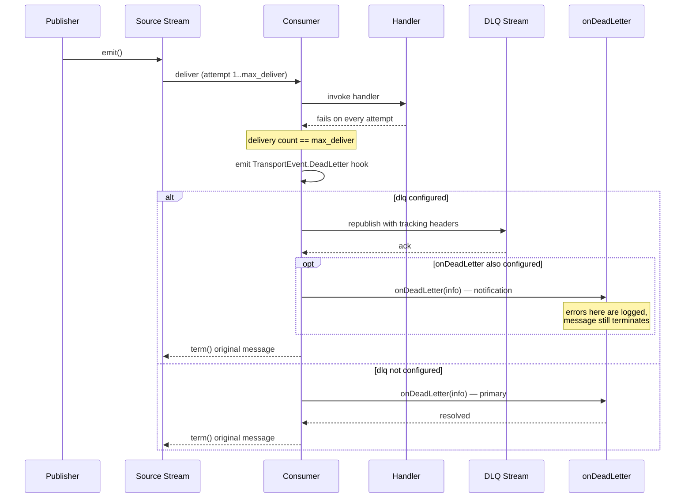

import Since from '@site/src/components/Since';

# How to configure a Dead Letter Queue

<Since version="2.2.0" />

When a message fails on every delivery attempt and exhausts its `max_deliver` limit, the transport treats it as a **dead letter**. Instead of silently discarding it, the library gives you two mechanisms to capture it:

1. **A built-in DLQ stream** *(added in v2.9.0)* — `dlq: { stream }` in your module options. Exhausted messages get republished to a dedicated JetStream stream with tracking headers. This is the recommended default.
2. **An `onDeadLetter` callback** — a hook with full dead letter context for custom persistence (database, S3, external queue).

Start with either. For maximum durability, use them together — the full fallback chain is described in [Built-in DLQ stream](#built-in-dlq-stream) below.

## What is a dead letter?

In NATS JetStream, each consumer has a `max_deliver` setting (default: **3**). Every time a handler throws an exception, the message is `nak`'d and redelivered. Once the delivery count reaches `max_deliver`, the message has nowhere to go — it's "dead."

Without a DLQ strategy, the transport would simply `term()` the message after the final failed attempt. With the DLQ stream or callback, you get a chance to save it before it's gone.



## Built-in DLQ stream

<Since version="2.9.0" />

The simplest production setup is one option on `forRoot()`:

```typescript
JetstreamModule.forRoot({
  name: 'orders',
  servers: ['nats://localhost:4222'],
  dlq: {
    stream: {
      max_age: toNanos(30, 'days'), // how long dead letters are retained
    },
  },
})
```

On startup, the library provisions a dedicated DLQ stream and, from that point on, every exhausted message is automatically republished to it with tracking headers. No callback needed for the happy path.

### What gets created

On application start, the library provisions (or updates) the DLQ JetStream stream with these defaults:

- **Stream name** &mdash; `{service}__microservice_dlq-stream` (e.g. `orders__microservice_dlq-stream`).
- **Retention** &mdash; `Workqueue`. Messages are removed when a DLQ consumer acks them.
- **`max_age`** &mdash; 30 days.
- **`max_bytes`** &mdash; 5 GB.
- **`max_msgs`** &mdash; 50,000,000.
- **`max_msg_size`** &mdash; 10 MB.
- **`max_consumers`** &mdash; 100.
- **`allow_rollup_hdrs`** &mdash; `false`.
- **`duplicate_window`** &mdash; 2 minutes.

You can override any of these via `dlq.stream`, for example to shorten retention or raise the byte cap. The stream name is always derived from your service name — any `name` field you set on `dlq.stream` is ignored, which keeps DLQ streams predictable across services. Full defaults live in `DEFAULT_DLQ_STREAM_CONFIG`.

The `dlqStreamName(serviceName)` helper is exported from the package so you can subscribe to the DLQ stream from elsewhere without hardcoding the name.

### Tracking headers on DLQ messages

Every message republished to the DLQ stream carries metadata headers so you can investigate, replay, or filter without decoding the payload first:

- **`x-dead-letter-reason`** &mdash; the error message from the last handler failure (extracted from `Error.message` or coerced via `String(error)`).
- **`x-original-subject`** &mdash; the subject the message was originally published to.
- **`x-original-stream`** &mdash; the source stream the message came from.
- **`x-failed-at`** &mdash; ISO 8601 timestamp of the moment the message entered the DLQ.
- **`x-delivery-count`** &mdash; how many times the message was delivered before it was marked dead.

The `JetstreamDlqHeader` enum is exported from the package — use it for type-safe header access in your DLQ consumer.

### Fallback chain

The transport uses a strict, **no-silent-loss** chain when handling a dead letter:

1. **Emit `TransportEvent.DeadLetter`** — fires for every dead letter, regardless of configuration (for observability). Happens unconditionally.
2. **Try DLQ stream publish (up to 3 attempts)** — if `dlq` is configured, publish the payload and tracking headers to the DLQ stream. A transient broker hiccup is retried in-process before giving up; this matters because the server never redelivers a message past `max_deliver`, so these attempts are the only second chance a dead letter gets.
3. **On successful publish — notify `onDeadLetter`** — if a callback is also registered, it is invoked as a **notification hook** (logging, metrics, alerting). Any error thrown by the callback at this stage is logged and swallowed; the original message still terminates successfully.
4. **On failed publish — fall back to `onDeadLetter`** — if every DLQ publish attempt throws (broker rejection, connectivity issue, disk full), the transport falls back to the callback so the payload still has a chance to land somewhere. On success, the message is terminated; on failure, it is `nak`'d.
5. **`nak()` as last resort** — if no callback is configured and the DLQ publish fails, or if the fallback callback also throws, the message is `nak`'d rather than silently terminated. Because the delivery count has reached `max_deliver`, NATS will **not** redeliver it — the message stays in the stream, visible to operators, until it is recovered manually or expires via `max_age`. An error log records every such case.

This chain guarantees that no message is terminated without passing through at least one recovery path.

:::note Callback role depends on context
With `dlq` configured, the callback is a **notification + safety net** — it fires on both successful and failed DLQ publishes, but with different semantics. On success it cannot block termination; on failure it is the last chance to persist the payload. Without `dlq`, the callback is the primary path (see [Callback flow (standalone mode)](#callback-flow-standalone-mode) below).
:::

## Configuring the callback

The `onDeadLetter` callback can be used in two ways:

- **Standalone** — no `dlq` option, just the callback. The transport calls it for every dead letter so you can persist the payload wherever you want (database, S3, external queue). This is the right choice when you need custom logic at the moment of failure (e.g., trigger an incident, update a UI, enrich with business context).
- **Alongside a DLQ stream** — used together with `dlq: { stream }`. The DLQ stream is the primary persistence path. The callback fires as a **notification hook** after every successful DLQ publish (errors are logged but do not block termination) and as a **fallback** if the DLQ publish itself throws. See the [Fallback chain](#fallback-chain) above for the full sequence.

Register `onDeadLetter` in `forRoot()` or `forRootAsync()`:

```typescript title="src/app.module.ts"
import { Module } from '@nestjs/common';
import { JetstreamModule } from '@horizon-republic/nestjs-jetstream';

@Module({
  imports: [
    JetstreamModule.forRoot({
      name: 'orders',
      servers: ['nats://localhost:4222'],
      onDeadLetter: async (info) => {
        console.error('Dead letter:', info.subject, info.error);
        // Persist to database, S3, another queue, etc.
      },
    }),
  ],
})
export class AppModule {}
```

## DeadLetterInfo fields

The callback receives a `DeadLetterInfo` object with everything you need to investigate the failure:

```typescript
interface DeadLetterInfo {
  /** The NATS subject the message was published to. */
  subject: string;
  /** Decoded message payload (already deserialized by the codec). */
  data: unknown;
  /** Raw NATS message headers. */
  headers: MsgHdrs | undefined;
  /** The error that caused the last handler failure. */
  error: unknown;
  /** How many times this message was delivered. */
  deliveryCount: number;
  /** The stream this message belongs to. */
  stream: string;
  /** The stream sequence number (unique within the stream). */
  streamSequence: number;
  /** ISO 8601 timestamp of the message (derived from NATS metadata). */
  timestamp: string;
}
```

## Callback flow (standalone mode)

When `dlq` is not configured and only the callback is registered, the flow is:

1. Handler fails on the final delivery attempt (`deliveryCount >= max_deliver`).
2. The transport builds a `DeadLetterInfo` object.
3. The `TransportEvent.DeadLetter` hook fires (for observability).
4. `onDeadLetter(info)` is called and awaited.
5. On success: the message is `term()`'d (terminated — removed from the stream permanently).
6. On failure: the message is `nak()`'d and stays in the stream — see the warning below.

:::warning Callback failures keep the message in the stream
If your `onDeadLetter` callback throws (e.g., the database is down), the message is **not** terminated — it is `nak`'d so the data is preserved. But the delivery count has already reached `max_deliver`, so NATS will **not** deliver it again: the message remains in the stream until you recover it manually (e.g. with `nats stream get` / a replay tool) or it expires via `max_age`. Each occurrence is recorded with an error log. If you combine the callback with `dlq: { stream }`, the DLQ publish (with its in-process retries) runs first, and the callback is only a fallback.
:::

## DI integration with forRootAsync

In real applications, the dead letter callback typically needs access to injected services — a repository, a queue client, a logger. Use `forRootAsync()` to inject dependencies:

```typescript title="src/app.module.ts"
import { Module } from '@nestjs/common';
import { JetstreamModule } from '@horizon-republic/nestjs-jetstream';
import { DlqModule, DlqService } from './dlq';

@Module({
  imports: [
    DlqModule,
    JetstreamModule.forRootAsync({
      name: 'orders',
      imports: [DlqModule],
      inject: [DlqService],
      useFactory: (dlqService: DlqService) => ({
        servers: ['nats://localhost:4222'],
        onDeadLetter: async (info) => {
          await dlqService.persist(info);
        },
      }),
    }),
  ],
})
export class AppModule {}
```

### Example DLQ service

```typescript title="src/dlq/dlq.service.ts"
import { Injectable, Logger } from '@nestjs/common';
import { DeadLetterInfo } from '@horizon-republic/nestjs-jetstream';
import { DlqRepository } from './dlq.repository';

@Injectable()
export class DlqService {
  private readonly logger = new Logger(DlqService.name);

  constructor(private readonly repository: DlqRepository) {}

  async persist(info: DeadLetterInfo): Promise<void> {
    this.logger.error(
      `Dead letter on ${info.subject} (stream: ${info.stream}, seq: ${info.streamSequence})`,
      info.error,
    );

    // Store in your database for later investigation or replay
    await this.repository.save({
      subject: info.subject,
      payload: JSON.stringify(info.data),
      error: info.error instanceof Error ? info.error.message : String(info.error),
      deliveryCount: info.deliveryCount,
      stream: info.stream,
      streamSequence: info.streamSequence,
      occurredAt: info.timestamp,
    });
  }
}
```

## Observability with TransportEvent.DeadLetter

In addition to the `onDeadLetter` callback, the transport emits a `TransportEvent.DeadLetter` hook event every time a dead letter is detected. This fires **before** the callback, regardless of whether `onDeadLetter` is configured.

Use it for metrics, alerting, or structured logging:

```typescript
import { JetstreamModule, TransportEvent } from '@horizon-republic/nestjs-jetstream';

JetstreamModule.forRoot({
  name: 'orders',
  servers: ['nats://localhost:4222'],
  hooks: {
    [TransportEvent.DeadLetter]: (info) => {
      metrics.increment('dead_letter_total', {
        stream: info.stream,
        subject: info.subject,
      });
    },
  },
  onDeadLetter: async (info) => {
    await dlqService.persist(info);
  },
})
```

:::tip Hook vs callback
The `TransportEvent.DeadLetter` **hook** is synchronous and fire-and-forget — use it for lightweight observability (metrics, logs). The `onDeadLetter` **callback** is async and awaited — use it for persistence that must succeed before the message is terminated. See [Lifecycle Hooks](/docs/guides/lifecycle-hooks) for more on the difference.
:::

## Scope

Dead letter detection applies to [**workqueue events**](/docs/patterns/events) and [**broadcast events**](/docs/patterns/broadcast) only. It does not apply to:

- [**RPC messages**](/docs/patterns/rpc) — RPC uses a request/reply pattern with its own timeout mechanism. Failed RPC handlers return error responses to the caller rather than entering a dead letter flow.
- [**Ordered events**](/docs/patterns/ordered-events) — Ordered consumers are ephemeral and auto-acknowledged by the NATS client. There is no ack/nak cycle, so there is no concept of delivery exhaustion.

## What's next?

- [**Events (Workqueue)**](/docs/patterns/events) — retry flow and delivery semantics
- [**Broadcast Events**](/docs/patterns/broadcast) — fan-out delivery with per-instance DLQ
- [**Lifecycle Hooks**](/docs/guides/lifecycle-hooks) — observe transport events including dead letters
- [**Module Configuration**](/docs/reference/module-configuration) — `forRoot()` and `forRootAsync()` options reference
