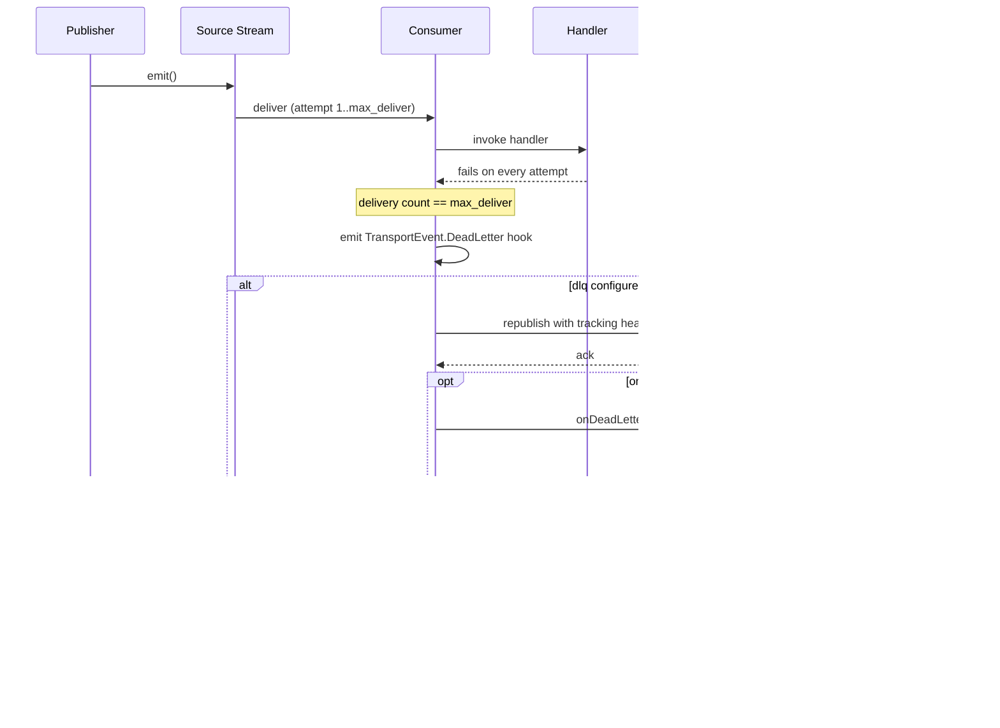

# How to configure a Dead Letter Queue

> **Use when:** a message has failed every delivery attempt and you need it kept instead of dropped.
> **You get:** the built-in DLQ stream, the `onDeadLetter` callback, and the fallback chain between them.

A message that fails every delivery attempt and reaches `max_deliver` (default **3**) becomes a dead letter. These two mechanisms capture it, and they compose:

| Mechanism               | Added  | Role                                                                           |
| ----------------------- | ------ | ------------------------------------------------------------------------------ |
| `dlq: { stream }`       | v2.9.0 | Republishes to a dedicated JetStream stream with tracking headers. Start here. |
| `onDeadLetter` callback | v2.2.0 | Full context for custom persistence: database, S3, another queue.              |

Two more cases become dead letters immediately, whatever the delivery count, because redelivery cannot fix them: **no registered handler** for the subject (a handler renamed mid-deploy while producers still publish the old pattern), and an **undecodable payload** (codec mismatch). Original bytes are preserved either way.


```mermaid
sequenceDiagram
    participant P as Publisher
    participant S as Source Stream
    participant C as Consumer
    participant H as Handler
    participant DLQ as DLQ Stream
    participant CB as onDeadLetter

    P->>S: emit()
    S->>C: deliver (attempt 1..max_deliver)
    C->>H: invoke handler
    H-->>C: fails on every attempt
    Note over C: delivery count == max_deliver
    C->>C: emit TransportEvent.DeadLetter hook
    alt dlq configured
        C->>DLQ: republish with tracking headers
        DLQ-->>C: ack
        opt onDeadLetter also configured
            C->>CB: onDeadLetter(info), notification
            Note over CB: errors here are logged,<br/>message still terminates
        end
        C-->>S: term() original message
    else dlq not configured
        C->>CB: onDeadLetter(info), primary
        CB-->>C: resolved
        C-->>S: term() original message
    end
```

## Built-in DLQ stream

The stream is provisioned and exhausted messages are republished to it without any configuration. Override it when the defaults do not fit, or turn it off with `dlq: false`:

```typescript
JetstreamModule.forRoot({
  name: 'orders',
  servers: ['nats://localhost:4222'],
  dlq: {
    stream: {
      max_age: toNanos(30, 'days'),
    },
  },
})
```

### Defaults

The stream is `{service}__microservice_dlq-stream`, reserves **256 MB** and keeps messages for **30 days** under `Limits` retention, so reading a dead letter does not consume it. Everything else matches the other streams; the [full table](/docs/reference/default-configs#stream-defaults) has the exact values, and `DEFAULT_DLQ_STREAM_CONFIG` is exported if you want to compose overrides on top of it.

Override through `dlq.stream`. A `name` there is ignored: the stream name always comes from the service name, which keeps DLQ streams predictable across a fleet. Use the exported `dlqStreamName(serviceName)` helper instead of hardcoding the pattern.

### Tracking headers

Every republished message holds metadata, so you can investigate, replay or filter without decoding the payload. The `JetstreamDlqHeader` enum is exported for type-safe access.

| Header                 | Contents                                                                     |
| ---------------------- | ---------------------------------------------------------------------------- |
| `x-dead-letter-reason` | Error message from the last failure, from `Error.message` or `String(error)` |
| `x-original-subject`   | Subject the message was published to                                         |
| `x-original-stream`    | Source stream it came from                                                   |
| `x-failed-at`          | ISO 8601 timestamp of entry into the DLQ                                     |
| `x-delivery-count`     | Deliveries before the message was marked dead                                |

### Externally managed stream

When the DLQ stream comes from Terraform or ArgoCD, bind to it instead of creating it:

```typescript
import { ManagementMode } from '@horizon-republic/nestjs-jetstream';

JetstreamModule.forRoot({
  name: 'orders',
  servers: ['nats://localhost:4222'],
  dlq: {
    stream: { name: 'ext_dlq' },
    management: { stream: ManagementMode.Manual },
  },
})
```

The stream's `subjects` list must contain exactly the DLQ stream name, so `ext_dlq` needs `subjects: ["ext_dlq"]`. The library validates this at boot and throws if the subject is not covered. See [Bring Your Own Infrastructure](/docs/guides/external-infrastructure#external-dlq).

## Fallback chain

No message terminates without passing a recovery path:

| Step                                | Condition                              | Outcome                                                                           |
| ----------------------------------- | -------------------------------------- | --------------------------------------------------------------------------------- |
| 1. Emit `TransportEvent.DeadLetter` | Always                                 | Observability, independent of configuration                                       |
| 2. Publish to the DLQ stream        | `dlq` configured                       | Up to 3 in-process attempts, since the server never redelivers past `max_deliver` |
| 3. Notify `onDeadLetter`            | Publish succeeded, callback registered | Errors are logged and swallowed; the message still terminates                     |
| 4. Fall back to `onDeadLetter`      | Every publish attempt failed           | Last chance to persist. Success terminates, failure naks                          |
| 5. `nak()`                          | No callback, or the fallback threw     | The message stays in the stream for manual recovery                               |

Step 5 leaves the message visible to operators until recovered by hand or expired by `max_age`, and every occurrence is logged. It is never redelivered: the delivery count already reached `max_deliver`.

## The callback

Without `dlq`, the callback is the primary path. With `dlq`, it is a notification on success and a fallback on failure.

```typescript title="src/app.module.ts"
JetstreamModule.forRoot({
  name: 'orders',
  servers: ['nats://localhost:4222'],
  onDeadLetter: async (info) => {
    console.error('Dead letter:', info.subject, info.error);
  },
})
```

Standalone flow: the handler fails on the final attempt and the transport builds `DeadLetterInfo`. The hook fires, the callback is awaited, and the message is either `term()`'d on success or `nak()`'d on failure.

:::warning A throwing callback keeps the message in the stream
If the callback fails, the message is `nak`'d instead of terminated, so the data survives. NATS will not deliver it again. It stays until manual recovery (`nats stream get`, a replay tool) or until `max_age`. Pairing the callback with `dlq: { stream }` puts the retried DLQ publish first and leaves the callback as fallback.
:::

### `DeadLetterInfo`

```typescript
interface DeadLetterInfo {
  /** The NATS subject the message was published to. */
  subject: string;
  /** Decoded message payload (already deserialized by the codec). */
  data: unknown;
  /** Raw NATS message headers. */
  headers: MsgHdrs | undefined;
  /** The error that caused the last handler failure. */
  error: unknown;
  /** How many times this message was delivered. */
  deliveryCount: number;
  /** The stream this message belongs to. */
  stream: string;
  /** The stream sequence number (unique within the stream). */
  streamSequence: number;
  /** ISO 8601 timestamp of the message (derived from NATS metadata). */
  timestamp: string;
}
```

### With injected services

A callback that writes to a repository or a queue client needs DI, so it belongs in `forRootAsync()`:

```typescript title="src/app.module.ts"
JetstreamModule.forRootAsync({
  name: 'orders',
  imports: [DlqModule],
  inject: [DlqService],
  useFactory: (dlqService: DlqService) => ({
    servers: ['nats://localhost:4222'],
    onDeadLetter: async (info) => {
      await dlqService.persist(info);
    },
  }),
})
```

```typescript title="src/dlq/dlq.service.ts"
@Injectable()
export class DlqService {
  private readonly logger = new Logger(DlqService.name);

  constructor(private readonly repository: DlqRepository) {}

  async persist(info: DeadLetterInfo): Promise<void> {
    this.logger.error(
      `Dead letter on ${info.subject} (stream: ${info.stream}, seq: ${info.streamSequence})`,
      info.error,
    );

    await this.repository.save({
      subject: info.subject,
      payload: JSON.stringify(info.data),
      error: info.error instanceof Error ? info.error.message : String(info.error),
      deliveryCount: info.deliveryCount,
      stream: info.stream,
      streamSequence: info.streamSequence,
      occurredAt: info.timestamp,
    });
  }
}
```

## Metrics and alerting

`TransportEvent.DeadLetter` fires before the callback, with or without one registered:

```typescript
import { JetstreamModule, TransportEvent } from '@horizon-republic/nestjs-jetstream';

JetstreamModule.forRoot({
  name: 'orders',
  servers: ['nats://localhost:4222'],
  hooks: {
    [TransportEvent.DeadLetter]: (info) => {
      metrics.increment('dead_letter_total', {
        stream: info.stream,
        subject: info.subject,
      });
    },
  },
})
```

The hook is synchronous and fire-and-forget, for metrics and logs. The callback is async and awaited, for persistence that must complete before termination. See [Lifecycle Hooks](/docs/guides/lifecycle-hooks).

## Scope

Dead letters apply to [workqueue](/docs/patterns/events) and [broadcast](/docs/patterns/broadcast) events. [RPC](/docs/patterns/rpc) returns errors to the caller under its own timeout, and [ordered events](/docs/patterns/ordered-events) are auto-acknowledged without an ack/nak cycle, so exhaustion has no meaning there.

## Next

- [Events (Workqueue)](/docs/patterns/events): retry flow and delivery semantics
- [Broadcast Events](/docs/patterns/broadcast): fan-out with per-instance DLQ
- [Lifecycle Hooks](/docs/guides/lifecycle-hooks)
- [Module Configuration](/docs/reference/module-configuration)
