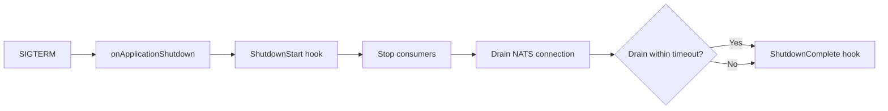

# Graceful Shutdown

> **Use when:** you are working out what a rolling deploy does to messages in flight.
> **You get:** the shutdown sequence, the drain timeout, and why redelivery is the guarantee instead of waiting.

The transport handles shutdown automatically through the NestJS application lifecycle. Consumption stops, then the connection drains. Whatever was still in flight comes back through redelivery, so you write no shutdown code yourself.

## How it works

The `JetstreamModule` hooks into NestJS's `OnApplicationShutdown` interface. When the application receives a termination signal (SIGTERM, SIGINT), NestJS calls the module's `onApplicationShutdown()` method, which triggers the following sequence:

1. **Emit `ShutdownStart` hook**: notifies lifecycle hooks that shutdown has begun.
2. **Stop consumers**: calls `strategy.close()`, which closes all RxJS subscriptions and stops JetStream consumer iterators. The transport takes no new messages and tears the routing pipeline down.
3. **Drain NATS connection**: calls `nc.drain()`, which flushes any pending publishes and closes the connection.
4. **Safety timeout**: if drain doesn't complete within `shutdownTimeout` milliseconds, the transport proceeds with shutdown anyway. This prevents a stuck connection from blocking the process indefinitely.
5. **Emit `ShutdownComplete` hook**: notifies lifecycle hooks that shutdown has finished.



## What "drain" means

NATS `drain()` is a graceful shutdown primitive. When you drain a connection:

- The client stops receiving new messages from all subscriptions.
- The client flushes pending publishes.
- Once the client finishes its own subscription work, the connection closes cleanly.

:::warning Handlers are not awaited
Shutdown stops consumption before draining, which tears down the routing pipeline. A handler that was mid-execution is abandoned, not awaited: its message never gets an ack, so JetStream redelivers it once the consumer's `ack_wait` expires. Delivery stays at-least-once and you lose nothing, but a handler running at SIGTERM will run again on another instance.

Design handlers to be idempotent and keep them short. If a unit of work must run only once, make it resumable or guard it with an idempotency key. Do not lean on shutdown to let it finish.
:::

## Configuring the timeout

The `shutdownTimeout` option controls how long the transport waits for the drain to complete. The default is **10 seconds** (10,000 ms).

```typescript title="src/app.module.ts"
import { Module } from '@nestjs/common';
import { JetstreamModule } from '@horizon-republic/nestjs-jetstream';

@Module({
  imports: [
    JetstreamModule.forRoot({
      name: 'orders',
      servers: ['nats://localhost:4222'],
      shutdownTimeout: 30_000, // 30 seconds for long-running handlers
    }),
  ],
})
export class AppModule {}
```

:::tip Choosing a timeout value
This budget covers the connection drain, not handler execution, so it does not need to exceed your slowest handler. The default of 10 seconds is ample for a healthy cluster. Raise it only if you see drains hitting the ceiling against a slow or degraded one.
:::

If the timeout fires before the drain completes, the transport closes the connection immediately. JetStream then redelivers anything left unacked once the consumer's `ack_wait` expires.

What actually governs redelivery overlap during a rolling deploy is `ack_wait`, not this timeout: a message abandoned at SIGTERM becomes available to another instance once that window passes.

## Multiple connections

With [connections](/docs/guides/multi-connection) shutdown runs in two phases instead of draining one connection at a time:

1. **Every** connection stops accepting new messages.
2. **Then** every connection drains in parallel, each bounded by its own `shutdownTimeout`.

The phases are separate on purpose: draining sequentially would let a connection keep taking work while its peers are already winding down.

The ceiling for the whole SIGTERM is `max(timeouts)`, not their sum. A connection that throws while draining does not stop the others from closing, and shutdown skips a non-critical connection that never connected.

```typescript
JetstreamModule.forRoot({
  name: 'orders',
  defaultConnection: 'primary',
  shutdownTimeout: 10_000,             // fallback for connections that set none
  connections: {
    primary: { servers: ['nats://primary:4222'], shutdownTimeout: 30_000 },
    analytics: { servers: ['nats://analytics:4222'], shutdownTimeout: 5_000 },
  },
})
```

Worst case above is 30 seconds, not 35.

## Enabling shutdown hooks

For the shutdown sequence to trigger, NestJS must listen for OS signals. Call `enableShutdownHooks()` in your bootstrap function:

```typescript title="src/main.ts"
import { NestFactory } from '@nestjs/core';
import { JetstreamStrategy } from '@horizon-republic/nestjs-jetstream';
import { AppModule } from './app.module';

async function bootstrap() {
  const app = await NestFactory.create(AppModule);

  app.connectMicroservice(
    { strategy: app.get(JetstreamStrategy) },
    { inheritAppConfig: true },
  );

  // Required for graceful shutdown to work, without this, SIGTERM
  // terminates the process before onApplicationShutdown() runs.
  app.enableShutdownHooks();

  await app.startAllMicroservices();
  await app.listen(3000);
}

void bootstrap();
```

:::warning Without enableShutdownHooks(), shutdown is not graceful
If you skip `enableShutdownHooks()`, the process dies on SIGTERM/SIGINT without calling `onApplicationShutdown()`. The NATS connection drops abruptly. JetStream still redelivers the in-flight messages once `ack_wait` expires, so you lose nothing, but the exit is not clean.
:::

## No manual shutdown code needed

Unlike some transports that require you to manage connection lifecycle manually, `nestjs-jetstream` handles everything through the NestJS module lifecycle:

- **Startup**: `forRoot()` creates the connection, streams, and consumers.
- **Shutdown**: `onApplicationShutdown()` drains the connection and cleans up.

You don't need to call `app.close()` in a signal handler or drain the connection by hand. The transport takes care of it.

## Observing shutdown with hooks

Use `ShutdownStart` and `ShutdownComplete` lifecycle hooks for logging or metrics:

```typescript
import { JetstreamModule, TransportEvent } from '@horizon-republic/nestjs-jetstream';

JetstreamModule.forRoot({
  name: 'orders',
  servers: ['nats://localhost:4222'],
  hooks: {
    [TransportEvent.ShutdownStart]: () => {
      console.log('NATS transport shutting down...');
    },
    [TransportEvent.ShutdownComplete]: () => {
      console.log('NATS transport shutdown complete');
    },
  },
})
```

See [Lifecycle Hooks](/docs/guides/lifecycle-hooks) for all available events.

## See also

A handler still running at shutdown is abandoned and its message is not acked. NATS redelivers it to another instance after `ack_wait` expires. Make sure your deployment strategy accounts for this overlap, and see [Dead Letter Queue](/docs/guides/dead-letter-queue) for what happens when a handler fails its final delivery attempt mid-shutdown.
