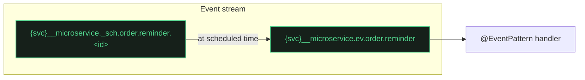

import Since from '@site/src/components/Since';

# How to schedule delayed messages

<Since version="2.8.0" />

One-shot delayed message delivery powered by [NATS 2.12 message scheduling](https://github.com/nats-io/nats-architecture-and-design/blob/main/adr/ADR-51.md) (ADR-51).

Publish an event now, have it delivered to the consumer at a future time. Replaces the need for external schedulers like Bull or Agenda for simple delayed jobs.

## Requirements

- **NATS Server >= 2.12**
- `allow_msg_schedules: true` on the event stream

## Configuration

Enable message scheduling on the event stream:

```typescript
JetstreamModule.forRoot({
  name: 'orders',
  servers: ['nats://localhost:4222'],
  events: {
    stream: { allow_msg_schedules: true },
  },
});
```

This flag is not enabled by default to maintain backward compatibility with NATS < 2.12. It can be safely added to existing streams — NATS applies it as a regular update without recreation or downtime.

## Usage

Use `scheduleAt()` on `JetstreamRecordBuilder` to delay delivery:

```typescript
import { JetstreamRecordBuilder } from '@horizon-republic/nestjs-jetstream';
import { lastValueFrom } from 'rxjs';

// Deliver in 1 hour
const record = new JetstreamRecordBuilder({ orderId: 42, type: 'reminder' })
  .scheduleAt(new Date(Date.now() + 60 * 60 * 1000))
  .build();

await lastValueFrom(this.client.emit('order.reminder', record));
```

The consumer handles it like any normal event — no changes needed on the receiving side:

```typescript
@EventPattern('order.reminder')
handleReminder(@Payload() data: OrderReminder) {
  // Executed at the scheduled time
}
```

## How it works

1. `scheduleAt(date)` stores the delivery time in the record
2. On publish, the library routes to a per-message unique `_sch` subject within the event stream (a library convention to separate scheduled messages from regular events). The unique suffix matters: the server stores schedules as rollup messages — one active schedule per subject ([ADR-51](https://github.com/nats-io/nats-architecture-and-design/blob/main/adr/ADR-51.md)) — so a shared subject would silently replace a pending schedule on every publish
3. The publish includes `Nats-Schedule` and `Nats-Schedule-Target` headers (ADR-51) — the server uses these headers, not the subject, to manage scheduling
4. NATS holds the message until the scheduled time, then publishes a **new message** to the target event subject and purges the fired schedule holder, so unique `_sch` subjects do not accumulate
5. The event consumer processes it normally



## Important: `max_age` consideration

Scheduled messages are stored in the event stream like any other message. If the stream's `max_age` expires before the scheduled delivery time, **NATS silently purges the message** — no delivery, no error.

The default event stream `max_age` is **7 days**. If you need to schedule messages further in the future, increase `max_age`:

```typescript
events: {
  stream: {
    allow_msg_schedules: true,
    max_age: 0, // no expiry — use when scheduling beyond 7 days
  },
},
```

:::caution
Setting `max_age: 0` disables automatic cleanup for **all** messages in the event stream, not just scheduled ones. Consider the storage implications for high-throughput streams.
:::

## Scheduling with a custom subject prefix

When a custom `subjectPrefix` is configured for an event or broadcast kind, the schedule holders live under `{prefix}_sch.` instead of the default `{service}__microservice._sch.` prefix:

| Prefix configuration | Schedule holder prefix |
|---|---|
| No custom prefix (default) | `{service}__microservice._sch.` |
| `subjectPrefix: 'company.orders.'` | `company.orders._sch.` |

If the stream is **externally managed** (`ManagementMode.Manual`), it must cover this prefix in its `subjects` list. Boot fails with an explicit error if the coverage is missing:

```
Stream "…" has scheduling enabled (allow_msg_schedules=true) but its subjects do not cover the schedule prefix "…". Add "…>" to the stream's subjects.
```

For example, a stream with `subjects: ["company.orders.>"]` already covers `company.orders._sch.>` because the wildcard `>` matches any suffix. No additional entry is needed.

If you used a prefix like `company.orders.events.` (narrower wildcard), you must add `company.orders._sch.>` explicitly or widen the wildcard.

See [Bring Your Own Infrastructure — Scheduling with a custom prefix](/docs/guides/external-infrastructure#scheduling-with-a-custom-prefix) for a full provisioning example.

## Limitations

- **One-shot only.** No cron or interval scheduling. NATS supports these ([ADR-51](https://github.com/nats-io/nats-architecture-and-design/blob/main/adr/ADR-51.md)), but the library currently exposes only `scheduleAt()` for one-shot delivery.
- **Workqueue events and broadcasts only.** `scheduleAt()` is ignored for RPC ([`client.send()`](/docs/patterns/rpc)) with a logged warning, and **throws** for [`ordered:` patterns](/docs/patterns/ordered-events) — the schedule holder cannot live in the same stream as an ordered target, which the server requires.
- **Future dates only.** `scheduleAt()` throws if the date is not in the future.
- **NATS >= 2.12.** `allow_msg_schedules` is not supported by older server versions.
- **`max_age` constraint.** Schedule delay must not exceed the stream's `max_age`; the pending schedule is an ordinary stored message and expires with the stream's retention. Note the **broadcast stream default is 1 hour**: scheduling a broadcast further out requires raising its `max_age`.
- **Per-stream opt-in.** Broadcast scheduling requires `allow_msg_schedules: true` on the [broadcast stream](/docs/patterns/broadcast) config separately.
- **`ttl()` applies to the delivered message.** Combining `.ttl()` with `.scheduleAt()` sets `Nats-Schedule-TTL`: the countdown starts when the scheduled message fires, not when it is published.

## See also

- [Record Builder & Deduplication](/docs/guides/record-builder#scheduled-delivery) — `JetstreamRecordBuilder.scheduleAt()` in the full builder API
- [Per-Message TTL](/docs/guides/per-message-ttl) — sibling feature for per-message expiration
- [Naming Conventions — Scheduling subjects](/docs/reference/naming-conventions#scheduling-subjects) — how the transport routes scheduled messages internally
- [Default Configs](/docs/reference/default-configs#enable-only-can-be-turned-on-but-never-off) — `allow_msg_schedules` in the enable-only stream properties table
