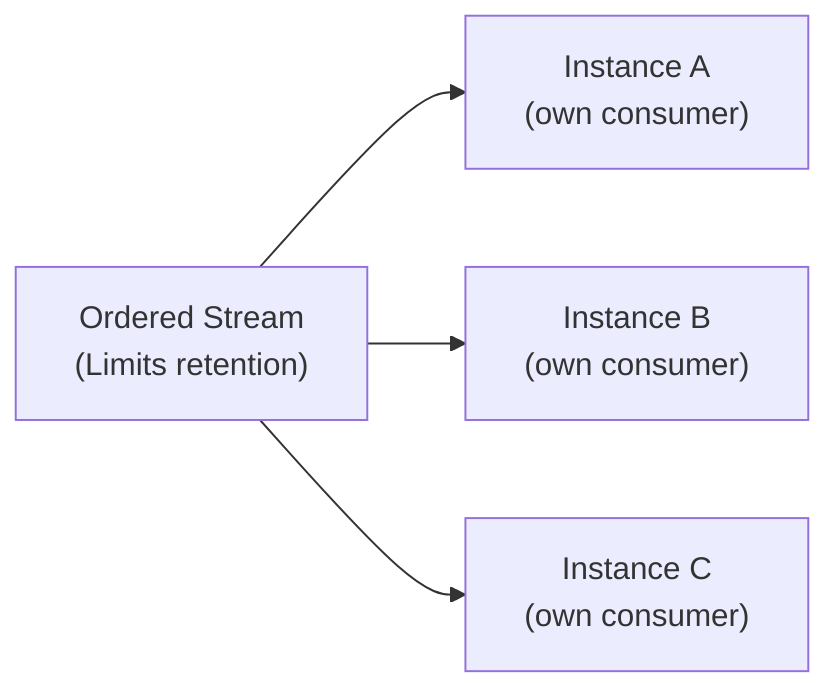

import Since from '@site/src/components/Since';

<Since version="2.4.0" />

# Ordered Events

> **Use when:** every replica needs to rebuild its own state from a strict, replayable event sequence (CQRS read models, in-memory caches, projections).
> **You get:** ephemeral ordered consumers: each replica reads the full stream in order, independently.

A projection that applies `delivered` before `shipped` is wrong, and one that misses a message diverges silently. [Workqueue events](/docs/patterns/events) balance load across instances, which is the opposite of what a replay needs. Ordered events give strict sequence, full replay, and an independent view per instance.

## How ordered consumers differ

An ordered consumer is ephemeral and lives in the client, not on the server: it will not appear in `nats consumer ls`, and it is recreated from scratch whenever the connection drops. It acks for you, so handler code never calls `msg.ack()` or `msg.nak()`, and the router pins its concurrency limit to one, so the next message waits for your handler to settle.

The stream behind it keeps messages under `Limits` retention for a day by default instead of deleting them on ack, which is what lets every instance read the same history independently. The [full comparison](#workqueue-or-ordered) with workqueue events is at the end of this page.

If the consumer disconnects, the transport re-establishes it through a `defer()` + `repeat()` loop with backoff from 100ms up to 30 seconds. See [self-healing consumers](/docs/reference/edge-cases#consumer-self-healing).

## At-most-once delivery

Nothing triggers a retry. The consumer always advances:

| Outcome                    | What happens                  |
| -------------------------- | ----------------------------- |
| Handler resolves           | Client acks, next message     |
| Handler throws             | Error logged, next message    |
| Decode error               | Error logged, message skipped |
| No handler for the subject | Error logged, message skipped |

Retrying would block every later message, since order has to hold, and one poison message would stop the pipeline. That is the trade-off strict ordering buys.

:::warning A throw loses the message
Neither `nak()` nor `term()` exists here. Catch errors inside the handler if a failure needs to reach a dead letter table or a retry queue.
:::

## Publishing and handling

The `ordered:` prefix routes to the ordered stream and is stripped from the subject, which becomes `{name}__microservice.ordered.order.status`. Handlers register without the prefix, using the `{ ordered: true }` flag.

```typescript title="src/orders/orders.service.ts"
import { Inject, Injectable } from '@nestjs/common';
import { ClientProxy } from '@nestjs/microservices';
import { lastValueFrom } from 'rxjs';

@Injectable()
export class OrdersService {
  constructor(@Inject('orders') private readonly client: ClientProxy) {}

  async shipOrder(orderId: number) {
    await lastValueFrom(
      this.client.emit('ordered:order.status', {
        orderId,
        status: 'shipped',
        timestamp: new Date().toISOString(),
      }),
    );
  }
}
```

```typescript title="src/projections/projections.controller.ts"
import { Controller } from '@nestjs/common';
import { EventPattern, Payload } from '@nestjs/microservices';

@Controller()
export class ProjectionsController {
  constructor(private readonly projections: ProjectionService) {}

  // Arrives in publish order, one at a time
  @EventPattern('order.status', { ordered: true })
  async handleOrderStatus(@Payload() data: OrderStatusDto) {
    await this.projections.applyStatusChange(data);
  }

  @EventPattern('order.created', { ordered: true })
  async handleOrderCreated(@Payload() data: OrderCreatedDto) {
    await this.projections.createProjection(data);
  }
}
```

Module side, with a week of history to replay from:

```typescript title="src/app.module.ts"
import { Module } from '@nestjs/common';
import { JetstreamModule, toNanos } from '@horizon-republic/nestjs-jetstream';

@Module({
  imports: [
    JetstreamModule.forRoot({
      name: 'projections',
      servers: ['nats://localhost:4222'],
      ordered: {
        stream: { max_age: toNanos(7, 'days') },
      },
    }),
    JetstreamModule.forFeature({ name: 'projections' }),
  ],
})
export class AppModule {}
```

## Deliver policies

The policy decides where a consumer starts reading when created or recreated, and it changes behaviour on every restart.

| Policy           | Starts at                        | After a restart                      | Use for                        |
| ---------------- | -------------------------------- | ------------------------------------ | ------------------------------ |
| `All` (default)  | Oldest message in the stream     | Replays everything within `max_age`  | Read models, event sourcing    |
| `New`            | Stream head at creation          | Skips whatever arrived while down    | Live dashboards, metrics       |
| `Last`           | Most recent message              | Delivers the latest again, then live | Single-value config caches     |
| `LastPerSubject` | Latest message of each subject   | Same as first start                  | Per-entity state maps          |
| `StartSequence`  | `optStartSeq`                    | Depends on the offset you store      | Resumable projections          |
| `StartTime`      | First message at or after a time | Replays from the same timestamp      | Debugging, time-based recovery |

`All` needs idempotent handlers, since a restart after a week replays a week. `New` loses messages published during downtime. `LastPerSubject` groups by the full NATS subject, so publishing to one subject makes it behave like `Last`; publish to `ordered:order.status.{orderId}` for per-entity delivery.

<details>
<summary>Configuring each policy</summary>

```typescript
import { DeliverPolicy } from '@nats-io/jetstream';

// New: live only
ordered: { deliverPolicy: DeliverPolicy.New }

// Last, or LastPerSubject for per-entity
ordered: { deliverPolicy: DeliverPolicy.LastPerSubject }

// StartTime, fixed or computed
ordered: {
  deliverPolicy: DeliverPolicy.StartTime,
  optStartTime: new Date(Date.now() - 60 * 60 * 1000).toISOString(),
}
```

`StartSequence` reads the offset your application stored, so it belongs in `forRootAsync()`:

```typescript
JetstreamModule.forRootAsync({
  name: 'projections',
  imports: [ConfigModule, OffsetModule],
  inject: [ConfigService, OffsetService],
  useFactory: (config: ConfigService, offsets: OffsetService) => ({
    servers: [config.getOrThrow('NATS_URL')],
    ordered: {
      deliverPolicy: DeliverPolicy.StartSequence,
      optStartSeq: offsets.getLastProcessedSequence('projections'),
    },
  }),
})
```

Store the sequence as part of handling the message:

```typescript
@EventPattern('order.status', { ordered: true })
async handleOrderStatus(@Payload() data: OrderStatusDto, @Ctx() ctx: RpcContext) {
  await this.projections.apply(data);

  // Ordered events are always JetStream, so a sequence is always present.
  const sequence = ctx.getSequence();

  if (sequence !== undefined) {
    await this.offsetStore.save('projections', sequence);
  }
}
```

With idempotent handlers and transactional offset storage, `StartSequence` is the only policy that reaches exactly-once processing.

</details>

:::tip Match `max_age` to the replay you need
`DeliverPolicy.All` can only replay what the stream still holds. Messages past `max_age` are deleted and unreachable.
:::

## Stream and replay configuration

Field reference lives in [OrderedEventOverrides](/docs/reference/module-configuration#orderedeventoverrides).

```typescript
import { DeliverPolicy, ReplayPolicy } from '@nats-io/jetstream';
import { toNanos } from '@horizon-republic/nestjs-jetstream';

ordered: {
  stream: {
    max_age: toNanos(7, 'days'),          // default 1 day
    max_bytes: 10 * 1024 * 1024 * 1024,   // default 5 GB
    max_msg_size: 1024 * 1024,            // default 10 MB
  },
  replayPolicy: ReplayPolicy.Original,     // default Instant
}
```

`ReplayPolicy.Instant` delivers history as fast as it can and is almost always right. `Original` reproduces the publishing rate, which matters for simulation and testing.

## Scaling

Every instance runs its own consumer and receives every message, without load balancing or consumer groups.



That is the design: ordered consumers build per-instance state such as caches, projections and in-memory indexes. For exactly one handler across the cluster, run one replica; the transport has no leader election. Distributed exclusive processing with ordering needs workqueue events over a single partition, or coordination outside the transport.

Because instances share the stream and restarts replay it, handlers have to be idempotent:

```typescript
@EventPattern('order.status', { ordered: true })
async handleOrderStatus(@Payload() data: OrderStatusDto) {
  // Upsert with a guard, never a blind insert
  await this.db.query(
    `INSERT INTO order_projections (order_id, status, updated_at)
     VALUES ($1, $2, $3)
     ON CONFLICT (order_id) DO UPDATE
     SET status = $2, updated_at = $3
     WHERE order_projections.updated_at < $3`,
    [data.orderId, data.status, data.timestamp],
  );
}
```

## Workqueue or ordered

|                         | Workqueue events                     | Ordered events                          |
| ----------------------- | ------------------------------------ | --------------------------------------- |
| **Delivery guarantee**  | At-least-once                        | At-most-once                            |
| **Message ordering**    | Not guaranteed (parallel)            | Strict sequential                       |
| **Handler parallelism** | Concurrent, bounded by `concurrency` | One message at a time                   |
| **Retry on failure**    | Yes, `nak` triggers redelivery       | No, error logged and skipped            |
| **Dead letter queue**   | Yes, after `max_deliver` attempts    | No                                      |
| **Acknowledgment**      | Explicit `msg.ack()`                 | Automatic by the client                 |
| **Stream retention**    | Workqueue, delete on ack             | Limits, delete by age or size           |
| **Consumer type**       | Durable, server-side                 | Ephemeral, client-side                  |
| **Scaling model**       | Load-balanced across instances       | Every instance gets every message       |
| **Replay on restart**   | No, acked messages are gone          | Yes, per deliver policy                 |
| **Publish prefix**      | _(none)_                             | `ordered:`                              |
| **Typical use case**    | Workload distribution, task queues   | Event sourcing, projections, audit logs |

Reach for workqueue when processing must be guaranteed and order does not matter. Reach for ordered when sequence is the point and every instance needs the whole stream.

## Caveats

**`DeliverPolicy.All` hangs the SDK.** Passing `All` explicitly leaves a residual `opt_start_seq` in the consumer configuration, which conflicts with the ordered consumer protocol and makes `consume()` hang. Observed in `nats` v2.29.x, still worked around for `@nats-io/jetstream` v3.x: the transport omits `deliver_policy` when the policy is `All` or unset, which the SDK treats identically. Every other policy passes through untouched. That absence shows up when you inspect the consumer with `nats consumer info`.

**No partial replay.** A reconnect recreates the consumer at the position the deliver policy dictates, not at the last message processed. Resumable processing needs `StartSequence` with your own offset storage.

**The stream name is derived.** It follows [naming conventions](/docs/reference/naming-conventions) as `{name}__microservice_ordered-stream` and cannot be set directly.

## Next

- [Events (Workqueue)](/docs/patterns/events): at-least-once with load balancing
- [Module Configuration](/docs/reference/module-configuration): the full `ordered` reference
- [Default Configs](/docs/reference/default-configs): stream and consumer defaults
- [Lifecycle Hooks](/docs/guides/lifecycle-hooks): errors, reconnections, transport events
- [Troubleshooting](/docs/guides/troubleshooting)
